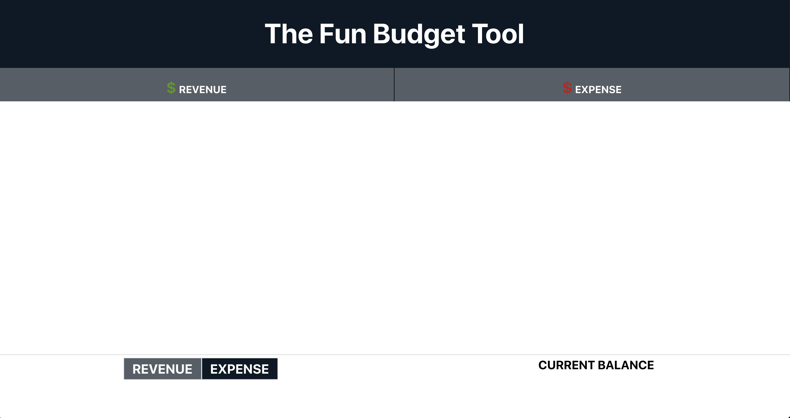

<<<<<<< HEAD
# The Fun Budget Tool

## Description
The Fun Budget Tool is an easy-to-use budgt planning app that allows users to track their personal finances. The app allows users to create simple lists of incoming revenue and outgoing expenses and keep track of the balance. 



## User Stories

- *I have a tendency to overspend, and need an app that will help me track my spending.*

  - The app allows users to quickly add the name and amount of an expense to their expense list. It will automatically calculate the total and subtract it from the user's current balance. 

- *I need to track my income.*

  - The app allows users to quickly add the name and amount of an incoming revenue (income, gifts, etc) to their expense list. It will automatically calculate the total and add it to the user's current balance. 

## Functionality
When a user adds a new revenue or expense to the app, the front-end communicates with the backend using Axios and Express routing to store and retrieve JSON data for each entry. 

## Technologies
The app is built using the MERN stack. The backend utilizes Mongo, Express and Node. The frontend is built using React. The frontend and backend communicate using Cors. The backend is stored on mLAB and deployed to Heroku. The frontend is deployed to Surge. 

## Getting Started

To use this app, visit the public site hosted on surge: [The Fun Budget Tool](http://the-fun-budget-tool.surge.sh/)

### Installation
To set up the app locally:
1. Fork and clone the project repository. 

2. Install all dependencies by running npm insttall in you CLI.
```
npm install
```

3. For the backend, make sure MongoDB is running in the background. 
```
mongod
```


## Authors
[Shakira Weir](https://github.com/shakiraweir)

[Evan Canoy](https://github.com/naveyonac)

[Fathia Mohammed](https://github.com/FATHIA123)

## Contribute

##### Source Code

- [front-end code](https://github.com/shakiraweir/expense-tracker)

- [front-end code](https://github.com/shakiraweir/expense-tracker)

## Issues

- Finish full CRUD on the revenues model. Currently, the user can add a new revenue, and see a list of entries and a specific entry. However, they cannot modify or delete an entry. Future improvements would fix this issue. 

- All entries for both revenue and expenses should be visible on the front page, along with the current total of each and the net total amount available. 

## Additional Features

### Calculations
A running total of all revenue and expenses and current net total will be visible on the homepage.

#### Categories
Allow the user to track and compare spending both weekly and monthly. Allow user to create and organize revenue and expense entries into categories. For example: 
- Revenue categories: income, gifts
- Expense categories: food, work

#### User log-in
Add user login and logout with authentication would be a next step, especially because this is a financial app that contains personal and potentially sensitive information.

#### Chart API
Includes a pie chart for expenses and revenues that provides a visual break down of the total amont spent in each category. 

## Issue Tracker

- [front-end](https://github.com/naveyonac/expense-tracker-api/issues)

- [back-end](https://github.com/naveyonac/expense-tracker-api/issues)

=======
# The Fun Budget Tool 

## Description
This app is a simple and fast budget planner / personal finance app. There are no categories to manage or no learning curve. It is designed for a user to create simple lists of their income and expenses so they can keep track of their balance.

## User Stories
- *I need an app that will help me keep track of how much I spend and receive.* 

  -  User can add a new revenue or new expense by manually typing in a quick description and the amount within either the revenue or expense category.

- *I need to be able to see a running total of how much I spend versus how much I have so I can make better budgeting decisions.*

  - The app will automatically calculate and display the total income and the total expenses, as well as the users current total. 


## Technologies Used
The app is built using the MERN stack. MongoDB, Express, Node.js is used for the backend and React for the frontend. The database is stored on MLAB. The backend is deployed to Heroku. The frontend is deployed to Surge.

## Functionality
The user can click on the revenue or expense tab on the homepage to view a list of all current revenue and expense entries. The user can click on the add revenue or expense tab to add a new entry. The user can click on an individual entry to edit or delete it. 

## Getting Started
To use the app, visit the public site hosted on Heroku:Pearls of Wisdom

To set up the app locally:

Fork and clone the project repository
Install all dependencies
## Issues/Future Improvement
## Contribute
>>>>>>> de1ce492be3bed60ca82a2b4d7ebeed02764224f
